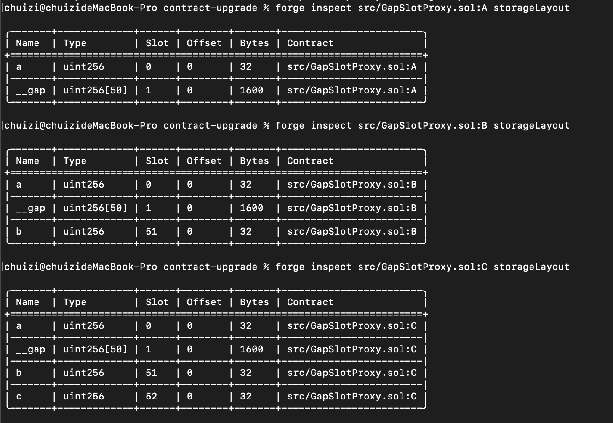

> ❓ 编写可升级合约时，如果逻辑实现合约有继承关系，什么情况下能父合约里添加变量？ 你认为的最佳实践是什么？

参考Demo： src/GapSlotProxy.sol

插槽信息打印：

---

> 📖 sepolia 代理合约
> * UUPS: `0xe56AA3135E82D66a3D1525C1418C0f8d05012deA`
> * TransparentProxy：`0x4406c71794372d1C889e0dA4C9CCe2aD908079da`